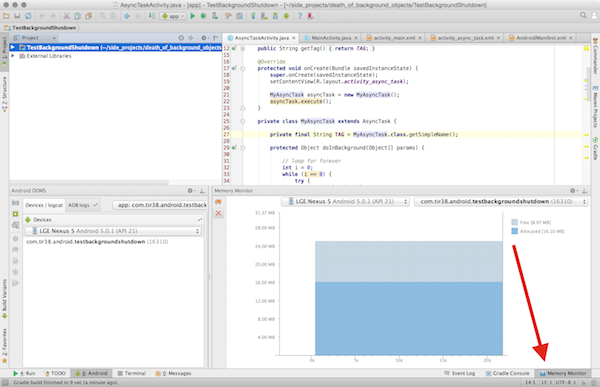
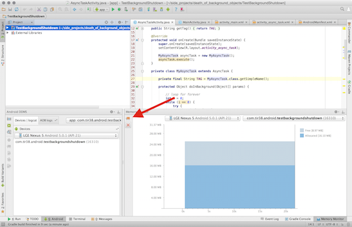

# android-background-death
What happens to your "behind the scenes" objects when when you kill an Activity? What happens to an AsyncTask if the Activity is killed? What about HandlerThreads or Loaders? This app will help you figure that out.

Memory Monitor and Forcing Garbage Collection
----
When asked to use the Memory Monitor tool from within Android Studio, you can start it here:

You can then force garbage collection here:

This will allow you to see if/when you are leaking memory.
